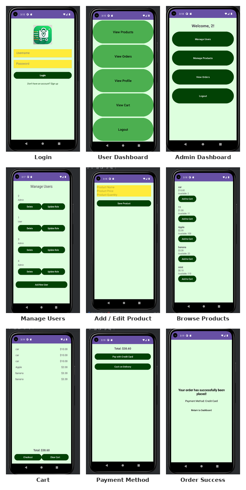

# Grocery Delivery App

A native Android grocery store app built for a Mobile Application Development course
(Islamic University of Madinah, Semester 2, 2024–25). Admins manage inventory and users;
customers browse, cart, and check out with either card or cash on delivery.



## Features

**Admin**
- Add, edit, and remove products (name, price, quantity)
- View all registered users, delete accounts, or switch a user's role between Admin and User
- View all placed orders

**User**
- Browse available products
- Add items to cart, view running total, clear cart
- Checkout with card or cash on delivery
- View profile and order history

## Architecture

- **Activities** — one per screen (`LoginActivity`, `AdminDashboardActivity`,
  `ProductListActivity`, `CartActivity`, etc.), each handling its own UI and logic
- **Models** — plain data objects: `Product`, `Order`, `User`, `Feedback`, `Address`, `CartItem`
- **Adapters** — bind data into `RecyclerView` lists (`ProductAdapter`, `OrdersAdapter`,
  `CartAdapter`, `UserAdapter`)
- **Database** — `DBHelper` wraps a local SQLite database (`users`, `products`, `orders`
  tables) and handles all CRUD operations plus login/role checks
- **Utils** — `CartManager` is a singleton holding the active cart (add/remove items,
  calculate total) across screens
- **Listeners** — callback interfaces connecting adapters back to their activities

Role-based access (Admin vs. User) is tracked via `SharedPreferences` after login.

## Repo structure

```
src/
  activities/   14 Activity classes (one per screen)
  models/       6 plain data objects
  adapters/     4 RecyclerView adapters
  listeners/    3 callback interfaces
  database/     DBHelper (SQLite)
  utils/        CartManager (singleton)
docs/
  grocery_app_report.docx   Full project report
assets/
  screenshots-overview.png  App flow screenshots
```

The files are grouped here by role for readability — see **Known limitations** below for
why this isn't a drop-in Android Studio project.

## Known limitations

- **This is source code, not a buildable project.** Only the `.java` classes exist —
  there's no `AndroidManifest.xml`, `build.gradle`, or `res/` folder (layouts, strings,
  the app icon), so this can't be opened and run in Android Studio as-is. It's shared
  here as a reference to the app's logic and structure.
- **Passwords are stored in plaintext** in the SQLite database, with a hardcoded default
  admin account. Fine for a course project, not for production — `DBHelper` itself notes
  `// Use encrypted passwords in production`.
- **Map integration is unfinished.** `MapsActivity` exists for future delivery-location
  tracking but isn't wired into the order flow yet.

## Tech stack

- **Java** — application logic
- **Android Studio / XML** — UI (layouts not included, see above)
- **SQLite** — local data persistence via `DBHelper`

## Future work

- Delivery tracking with live location and estimated delivery time
- Encrypted password storage
- Complete the missing project scaffolding (manifest, layouts, gradle) for a runnable build

## References

- Dr. Tanweer's Mobile Application Development course materials
- [Android SQLite tutorial (YouTube)](https://www.youtube.com/watch?v=fis26HvvDII)
- [Stack Overflow — android-studio tag](https://stackoverflow.com/questions/tagged/android-studio)
